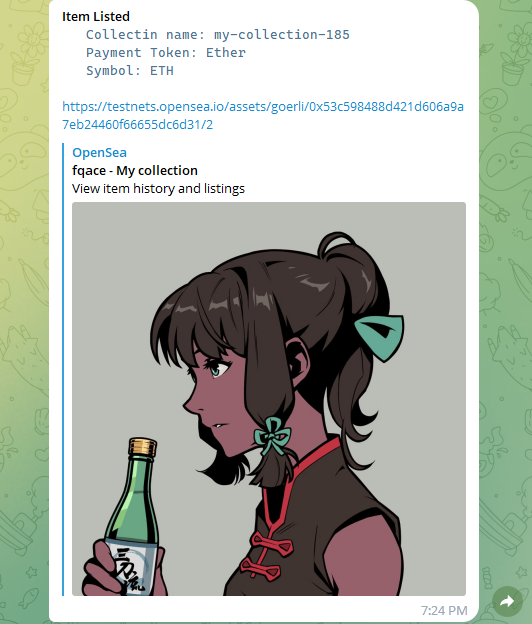

# OpenSea Telegram Bot



## Overview

The OpenSea Telegram Bot is a project designed to listen for listing events and new token launch events on both the Ethereum mainnet and testnet using the OpenSea Stream API. It sends notifications to Telegram users whenever a new token is listed or launched.

## Features

- Listens for listing events on the Ethereum mainnet and testnet.
- Sends notifications to Telegram users for new token launches.

## Technologies Used

- [Telegraf](https://telegraf.js.org/): A modern Telegram bot framework for Node.js.
- [OpenSea Stream API](https://github.com/ProjectOpenSea/opensea-stream-js): A library for interacting with the OpenSea WebSocket API.
- [WebSocket](https://github.com/websockets/ws): A simple to use, blazing-fast, and thoroughly tested WebSocket implementation for Node.js.

## Prerequisites

Before running the bot, ensure you have the following installed:

- [Node.js](https://nodejs.org/)
- [npm](https://www.npmjs.com/)

## Installation

1. Clone the repository:

   ```bash
   git clone https://github.com/PrantaDas/nft-listing-newsBot.git
2. Navigate to the directory
    ```bash
    cd nft-listing-newsBot
    ```
3. Install the dependencies 
    ```bash
    npn i  or yarn
    ```

### Configuration
Edit the .env file to include your Telegram bot token and other necessary configuration options.

```bash
BOT_TOKEN = your_telegram_bot_token
USER_ID = your_telegram_userId
```

### Usage

Run the bot using the following command:

```bash
npm run dev or yarn dev
```
The bot will start listening for OpenSea events and sending notifications to Telegram users.

### Telegram Commands

* `/start`: Start the bot and get a welcome message.
* ` /greet`: Get a greeting message from the bot.
* `/status`: Check the status of the bot.

### OpenSea Event Notifications
The bot will automatically send notifications to Telegram users when new tokens are listed or launched on both the Ethereum mainnet and testnet.

### Contributing
Feel free to contribute to the project by opening issues or submitting pull requests.

